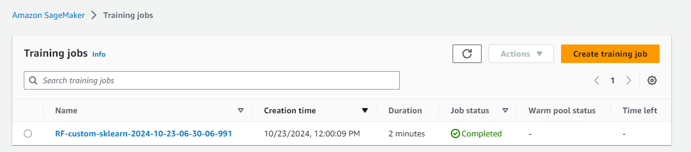
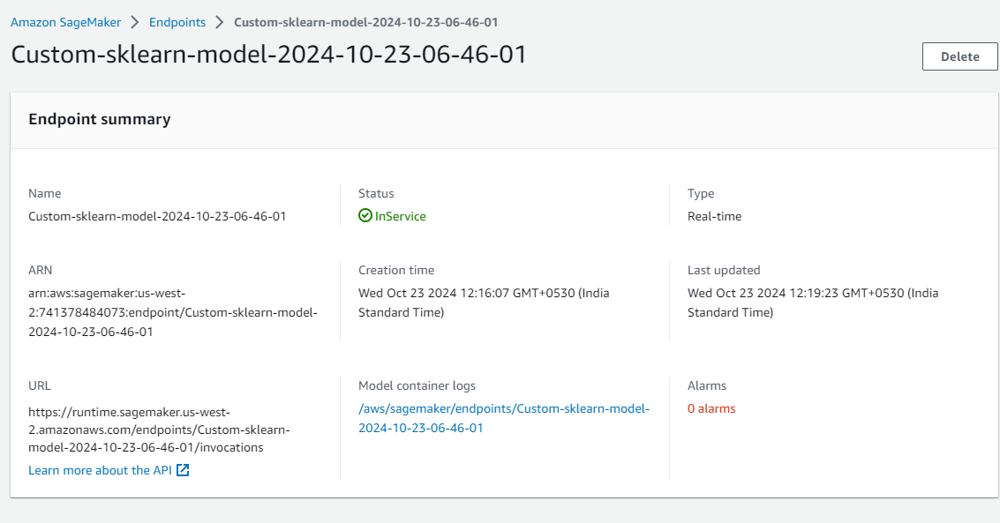

# Mobile Price Classification using AWS SageMaker

## Overview

This project demonstrates how to build a machine learning model to classify mobile phone prices using AWS SageMaker. We will utilize Boto3 for S3 bucket management, handle IAM roles, and implement the entire infrastructure for model training and deployment.

## What we'll learn about and use 

1. **S3 Buckets with Boto3**: Learn how to manage data storage and retrieval in AWS S3.
2. **IAM Roles and Users**: Understand the security aspects of AWS by configuring roles and permissions.
3. **AWS SageMaker Infrastructure**: Set up training jobs and deploy models with SageMaker.

## Project Structure

- **Data Preparation**: The script loads the mobile price dataset, processes it, and uploads it to an S3 bucket.
- **Model Training**: A Random Forest model is trained using the training data.
- **Model Evaluation**: The trained model is evaluated on a test dataset.
- **Model Deployment**: The model is deployed as a SageMaker endpoint for real-time predictions.

## Prerequisites

- An AWS account with permissions for SageMaker, S3, and IAM.
- Python libraries: `boto3`, `pandas`, `sagemaker`, `sklearn`.

## Getting Started

1. **Clone the Repository**: Clone this repository to your local machine.
2. **Upload Dataset**: Ensure your dataset (`mob_price_classification_train.csv`) is in the working directory.
3. **Run the Notebook**: Execute the Jupyter notebook to prepare data, train the model, and deploy it.
4. **Make Predictions**: Use the deployed endpoint to make predictions on new data.

## Notes

- Ensure you replace `<account_id>` and `<role_name>` in the scripts with your actual AWS account details and IAM role.
- Adjust instance types and counts based on your requirements and budget.

## Training and Inference Snapshots from SageMaker

